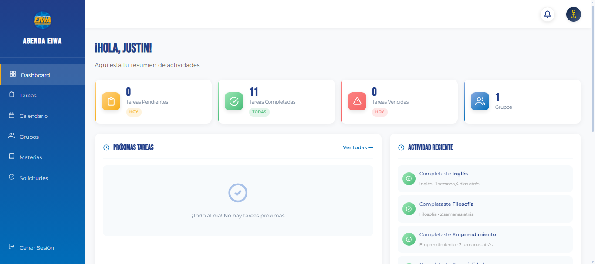
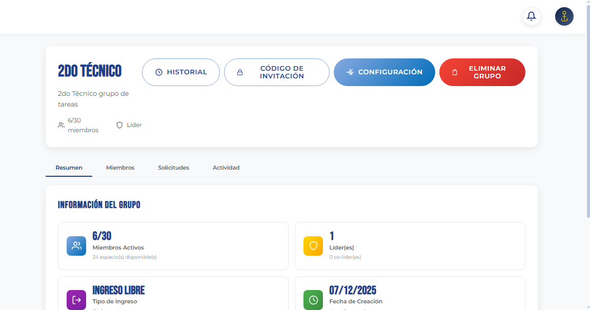

# 📚 Academic Task Manager (EIWA Academic Demo)

⭐ **If you like this project, consider giving it a star!**

## 🎓 Organize your academic life in one place

Open-source academic productivity platform designed to manage tasks, subjects, and study groups with an intelligent calendar and real-time updates.

> Built with Django and designed with production-ready architecture.

> ⚠️ **Disclaimer**  
> This project is an independent academic demonstration developed for an educational technology fair.  
> It is not an official EIWA platform. The EIWA name, logo, and institutional colors  
> are used strictly for academic identification purposes.

🌐 **[Live Demo](https://agendavirtualeiwa.onrender.com/)** | 🐛 [Report Bug](https://github.com/Justin-Ocana/academic-task-manager/issues)


---

## 📸 Vista del Sistema

### Dashboard Principal


### Calendario Inteligente


### Gestión de Grupos


---

## 🚀 Quick Start

```bash
# 1. Clonar repositorio
git clone https://github.com/Justin-Ocana/academic-task-manager.git
cd academic-task-manager

# 2. Instalar dependencias
python -m venv venv
source venv/bin/activate  # Windows: venv\Scripts\activate
pip install -r requirements.txt

# 3. Configurar y ejecutar
cd AgendaVirtualEiwa
python manage.py migrate
python manage.py createsuperuser
python manage.py runserver

# 4. Abrir en navegador
# http://localhost:8000
```

---

## 💡 El Problema

Los estudiantes enfrentan:
- 📝 Tareas dispersas en múltiples plataformas
- 👥 Dificultad para coordinar grupos de estudio
- 📅 Calendarios desorganizados
- 🔔 Pérdida de notificaciones importantes
- 🤝 Falta de herramientas colaborativas efectivas

## ✅ La Solución

Una plataforma centralizada con arquitectura modular que integra gestión de tareas, calendario inteligente, grupos colaborativos y actualizaciones en tiempo real.

---

## ⚡ Características Clave

### 📋 Gestión de Tareas
- Crear, organizar y priorizar tareas (Baja/Media/Alta)
- Estados: Pendiente → En Progreso → Completada
- Filtros inteligentes por materia, fecha, estado y prioridad
- Asignación a grupos con notificaciones automáticas

### 📅 Calendario Inteligente
- Vista mensual y semanal con indicadores de carga
- Colores por materia para identificación rápida
- Agregar tareas directamente desde el calendario
- Visualización de deadlines y distribución de trabajo

### 👥 Grupos Colaborativos
- Sistema de roles: Líder, Co-líder, Miembro
- Grupos públicos o privados con solicitudes de ingreso
- Moderación de contenido inteligente (estilo Roblox)
- Gestión de miembros: promover, expulsar, banear

### 🔔 Notificaciones en Tiempo Real
- WebSockets para actualizaciones instantáneas
- Push notifications en navegador
- Recordatorios de tareas próximas a vencer
- Alertas de cambios en grupos

### 🎨 Experiencia de Usuario
- Modo oscuro completo
- PWA instalable como app nativa
- Responsive design (móvil, tablet, escritorio)
- Interfaz intuitiva con colores institucionales

---

## 🏗️ Arquitectura Preparada para Producción

### Stack Tecnológico

**Backend**
- Django 5.2 con arquitectura modular por apps
- PostgreSQL con consultas optimizadas
- Sistema de autenticación personalizado
- ORM con validación en 3 capas

**Frontend**
- HTML5 semántico + CSS3 moderno (variables, Grid, Flexbox)
- JavaScript ES6+ (Fetch API, LocalStorage, WebSockets)
- PWA con Service Workers
- Responsive design mobile-first

**Infraestructura**
- Gunicorn + WhiteNoise para producción
- Deploy automatizado en Render.com
- Sistema de caché implementado
- Compresión de assets estáticos

### Estructura Modular

```
AgendaVirtualEiwa/
├── apps/
│   ├── accounts/          # Autenticación y usuarios
│   ├── calendar_app/      # Calendario inteligente
│   ├── core/              # Funcionalidades centrales
│   ├── groups/            # Sistema de grupos colaborativos
│   ├── notifications/     # Notificaciones en tiempo real
│   ├── subjects/          # Gestión de materias
│   ├── tasks/             # CRUD de tareas con estados
│   └── tracking/          # Historial y reversión de cambios
├── static/                # Assets optimizados
├── templates/             # Sistema de plantillas Django
└── manage.py
```

### Seguridad Implementada

- Validación en 3 capas: Frontend → Forms → Models
- Protección CSRF en todos los formularios
- Contraseñas hasheadas con PBKDF2_SHA256
- Sistema anti-troll con detección de contenido inapropiado
- Sanitización de entrada para prevenir XSS
- ORM para prevención de inyección SQL

---

## 🧠 Desafíos Técnicos Resueltos

### 1. Sistema de Roles Escalable
Implementación de jerarquía de permisos (Líder → Co-líder → Miembro) con validación en cada acción para garantizar seguridad y control granular.

### 2. Moderación Inteligente Anti-Abuso
Sistema de filtrado de contenido con detección de variaciones (leet speak, espacios, caracteres especiales) y 3 modos de acción configurables.

### 3. Optimización de Consultas Complejas
Uso de `select_related` y `prefetch_related` para reducir queries N+1, mejorando rendimiento en vistas con múltiples relaciones.

### 4. Validación en Múltiples Capas
Arquitectura de validación redundante (Frontend → Forms → Models) que garantiza integridad de datos incluso si una capa falla.

---

## 🛠️ Tecnologías

**Core**: Django 5.2 • Python 3.10 • PostgreSQL  
**Frontend**: HTML5 • CSS3 • JavaScript ES6+  
**Deploy**: Gunicorn • WhiteNoise • Render.com  
**Features**: PWA • WebSockets • Responsive Design

---

## 🗺️ Roadmap

### v1.1 - Comunicación (En desarrollo)
- Chat grupal en tiempo real
- Mensajes directos
- Notificaciones por email

### v1.2 - Colaboración (Planeado)
- Compartir archivos en grupos
- Editor colaborativo
- Videollamadas integradas

### v1.3 - Inteligencia (Futuro)
- Sugerencias con IA
- Análisis de productividad
- Detección automática de fechas

**Contributions and feature suggestions are welcome!** Feel free to open an issue or submit a pull request.

---

## 📊 Uso

### Para Estudiantes
1. Registrarse y crear materias
2. Agregar tareas con fechas y prioridades
3. Unirse a grupos de estudio
4. Visualizar calendario y organizar semana

### Para Líderes de Grupo
1. Crear grupo (público/privado)
2. Gestionar solicitudes de ingreso
3. Asignar tareas a miembros
4. Configurar moderación de contenido

---

## 💼 Real-World Use Case

This platform was developed as an academic demonstration project for the EIWA Informatics Fair, addressing real student coordination challenges:

- Organizing group projects across multiple subjects
- Coordinating team deliveries and deadlines
- Maintaining completed task history
- Managing weekly workload distribution

The modular architecture demonstrates scalability potential for educational institutions.

---

## 🎓 Academic Context

This project was created as a student-developed demonstration for an academic technology fair. It is intended for educational and portfolio purposes only and does not represent an official institutional system.

**Development Purpose:**
- Showcase full-stack development skills
- Demonstrate production-ready architecture
- Address real academic coordination problems
- Serve as portfolio piece for technical interviews

---

## 👨‍💻 Autor

**Justin Ocaña**  
Backend Developer | Estudiante de Bachillerato

Backend Developer enfocado en arquitectura limpia y sistemas escalables.  
Estudiante de último año de bachillerato | Aspirante a Ingeniería en Ciencias de la Computación

📧 justin.ocana.molina@gmail.com  
🔗 [GitHub](https://github.com/Justin-Ocana)  
🌐 [Portafolio Digital](https://justin-ocana.github.io/)

---

## 📄 License

This project is shared for educational and portfolio purposes.

**Source Code:** The technical implementation is open-source and available for learning purposes.

**Branding Restrictions:** The EIWA name, logo, and institutional branding are property of their respective owners and may not be reused. This repository showcases the technical implementation only; brand assets are excluded from reuse permissions.

**Usage:** Source code may be studied and adapted for educational purposes with proper attribution. Commercial use of institutional branding is not permitted without authorization.

---

**Developed with ❤️ by Justin Ocaña as an academic demonstration project**

# 📚 Academic Task Manager (EIWA Academic Demo)

⭐ **If you like this project, consider giving it a star!**

## 🎓 Organize your academic life in one place

Open-source academic productivity platform designed to manage tasks, subjects, and study groups with an intelligent calendar and real-time updates.

> Built with Django and designed with production-ready architecture.

> ⚠️ **Disclaimer**  
> This project is an independent academic demonstration developed for an educational technology fair.  
> It is not an official EIWA platform. The EIWA name, logo, and institutional colors  
> are used strictly for academic identification purposes.

🌐 **[Live Demo](https://agendavirtualeiwa.onrender.com/)** | 🐛 [Report Bug](https://github.com/Justin-Ocana/academic-task-manager/issues)


---

## 📸 Vista del Sistema

### Dashboard Principal


### Calendario Inteligente


### Gestión de Grupos


---

## 🚀 Quick Start

```bash
# 1. Clonar repositorio
git clone https://github.com/Justin-Ocana/academic-task-manager.git
cd academic-task-manager

# 2. Instalar dependencias
python -m venv venv
source venv/bin/activate  # Windows: venv\Scripts\activate
pip install -r requirements.txt

# 3. Configurar y ejecutar
cd AgendaVirtualEiwa
python manage.py migrate
python manage.py createsuperuser
python manage.py runserver

# 4. Abrir en navegador
# http://localhost:8000
```

---

## 💡 El Problema

Los estudiantes enfrentan:
- 📝 Tareas dispersas en múltiples plataformas
- 👥 Dificultad para coordinar grupos de estudio
- 📅 Calendarios desorganizados
- 🔔 Pérdida de notificaciones importantes
- 🤝 Falta de herramientas colaborativas efectivas

## ✅ La Solución

Una plataforma centralizada con arquitectura modular que integra gestión de tareas, calendario inteligente, grupos colaborativos y actualizaciones en tiempo real.

---

## ⚡ Características Clave

### 📋 Gestión de Tareas
- Crear, organizar y priorizar tareas (Baja/Media/Alta)
- Estados: Pendiente → En Progreso → Completada
- Filtros inteligentes por materia, fecha, estado y prioridad
- Asignación a grupos con notificaciones automáticas

### 📅 Calendario Inteligente
- Vista mensual y semanal con indicadores de carga
- Colores por materia para identificación rápida
- Agregar tareas directamente desde el calendario
- Visualización de deadlines y distribución de trabajo

### 👥 Grupos Colaborativos
- Sistema de roles: Líder, Co-líder, Miembro
- Grupos públicos o privados con solicitudes de ingreso
- Moderación de contenido inteligente (estilo Roblox)
- Gestión de miembros: promover, expulsar, banear

### 🔔 Notificaciones en Tiempo Real
- WebSockets para actualizaciones instantáneas
- Push notifications en navegador
- Recordatorios de tareas próximas a vencer
- Alertas de cambios en grupos

### 🎨 Experiencia de Usuario
- Modo oscuro completo
- PWA instalable como app nativa
- Responsive design (móvil, tablet, escritorio)
- Interfaz intuitiva con colores institucionales

---

## 🏗️ Arquitectura Preparada para Producción

### Stack Tecnológico

**Backend**
- Django 5.2 con arquitectura modular por apps
- PostgreSQL con consultas optimizadas
- Sistema de autenticación personalizado
- ORM con validación en 3 capas

**Frontend**
- HTML5 semántico + CSS3 moderno (variables, Grid, Flexbox)
- JavaScript ES6+ (Fetch API, LocalStorage, WebSockets)
- PWA con Service Workers
- Responsive design mobile-first

**Infraestructura**
- Gunicorn + WhiteNoise para producción
- Deploy automatizado en Render.com
- Sistema de caché implementado
- Compresión de assets estáticos

### Estructura Modular

```
AgendaVirtualEiwa/
├── apps/
│   ├── accounts/          # Autenticación y usuarios
│   ├── calendar_app/      # Calendario inteligente
│   ├── core/              # Funcionalidades centrales
│   ├── groups/            # Sistema de grupos colaborativos
│   ├── notifications/     # Notificaciones en tiempo real
│   ├── subjects/          # Gestión de materias
│   ├── tasks/             # CRUD de tareas con estados
│   └── tracking/          # Historial y reversión de cambios
├── static/                # Assets optimizados
├── templates/             # Sistema de plantillas Django
└── manage.py
```

### Seguridad Implementada

- Validación en 3 capas: Frontend → Forms → Models
- Protección CSRF en todos los formularios
- Contraseñas hasheadas con PBKDF2_SHA256
- Sistema anti-troll con detección de contenido inapropiado
- Sanitización de entrada para prevenir XSS
- ORM para prevención de inyección SQL

---

## 🧠 Desafíos Técnicos Resueltos

### 1. Sistema de Roles Escalable
Implementación de jerarquía de permisos (Líder → Co-líder → Miembro) con validación en cada acción para garantizar seguridad y control granular.

### 2. Moderación Inteligente Anti-Abuso
Sistema de filtrado de contenido con detección de variaciones (leet speak, espacios, caracteres especiales) y 3 modos de acción configurables.

### 3. Optimización de Consultas Complejas
Uso de `select_related` y `prefetch_related` para reducir queries N+1, mejorando rendimiento en vistas con múltiples relaciones.

### 4. Validación en Múltiples Capas
Arquitectura de validación redundante (Frontend → Forms → Models) que garantiza integridad de datos incluso si una capa falla.

---

## 🛠️ Tecnologías

**Core**: Django 5.2 • Python 3.10 • PostgreSQL  
**Frontend**: HTML5 • CSS3 • JavaScript ES6+  
**Deploy**: Gunicorn • WhiteNoise • Render.com  
**Features**: PWA • WebSockets • Responsive Design

---

## 🗺️ Roadmap

### v1.1 - Comunicación (En desarrollo)
- Chat grupal en tiempo real
- Mensajes directos
- Notificaciones por email

### v1.2 - Colaboración (Planeado)
- Compartir archivos en grupos
- Editor colaborativo
- Videollamadas integradas

### v1.3 - Inteligencia (Futuro)
- Sugerencias con IA
- Análisis de productividad
- Detección automática de fechas

**Contributions and feature suggestions are welcome!** Feel free to open an issue or submit a pull request.

---

## 📊 Uso

### Para Estudiantes
1. Registrarse y crear materias
2. Agregar tareas con fechas y prioridades
3. Unirse a grupos de estudio
4. Visualizar calendario y organizar semana

### Para Líderes de Grupo
1. Crear grupo (público/privado)
2. Gestionar solicitudes de ingreso
3. Asignar tareas a miembros
4. Configurar moderación de contenido

---

## 💼 Real-World Use Case

This platform was developed as an academic demonstration project for the EIWA Informatics Fair, addressing real student coordination challenges:

- Organizing group projects across multiple subjects
- Coordinating team deliveries and deadlines
- Maintaining completed task history
- Managing weekly workload distribution

The modular architecture demonstrates scalability potential for educational institutions.

---

## 🎓 Academic Context

This project was created as a student-developed demonstration for an academic technology fair. It is intended for educational and portfolio purposes only and does not represent an official institutional system.

**Development Purpose:**
- Showcase full-stack development skills
- Demonstrate production-ready architecture
- Address real academic coordination problems
- Serve as portfolio piece for technical interviews

---

## 👨‍💻 Autor

**Justin Ocaña**  
Desarrollador Full Stack | Estudiante de Ingeniería

📧 justin.ocana.molina@gmail.com  
🔗 [GitHub](https://github.com/Justin-Ocana)  
🌐 [Portafolio Digital](https://tu-portafolio.com)

---

## 📄 License

This project is shared for educational and portfolio purposes.

**Source Code:** The technical implementation is open-source and available for learning purposes.

**Branding Restrictions:** The EIWA name, logo, and institutional branding are property of their respective owners and may not be reused. This repository showcases the technical implementation only; brand assets are excluded from reuse permissions.

**Usage:** Source code may be studied and adapted for educational purposes with proper attribution. Commercial use of institutional branding is not permitted without authorization.

---

**Developed with ❤️ by Justin Ocaña as an academic demonstration project**
